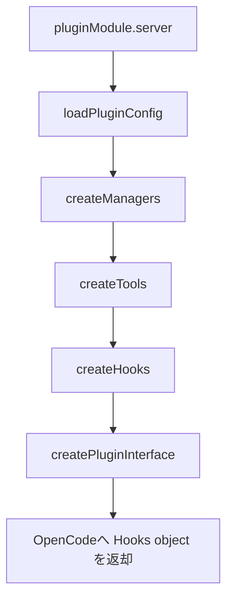
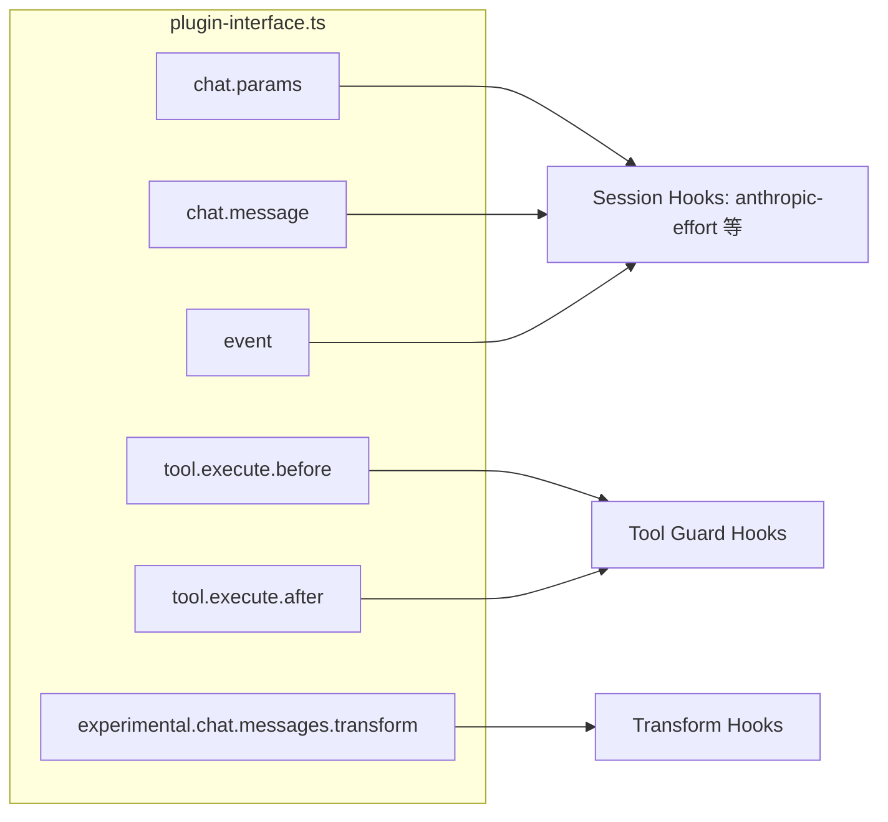

# OpenCode プラグインシステム全体概要

## 目次
- [1. 調査スコープと前提](#1-調査スコープと前提)
- [2. プラグインの役割と責務](#2-プラグインの役割と責務)
- [3. 初期化アーキテクチャ](#3-初期化アーキテクチャ)
- [4. OpenCode フック面の全体像](#4-opencode-フック面の全体像)
- [5. プラグインの設計思想](#5-プラグインの設計思想)
- [6. 未確認事項・要確認ポイント](#6-未確認事項要確認ポイント)

## 1. 調査スコープと前提

本設計書は、`oh-my-openagent`（`oh-my-opencode` の移行名）リポジトリの実装から、OpenCode プラグイン機構を逆解析した内容です。

- エントリポイント: `src/index.ts`
- プラグインインターフェース組み立て: `src/plugin-interface.ts`
- フック合成: `src/create-hooks.ts` と `src/plugin/hooks/*`
- プロバイダー別制御: `src/plugin/chat-params.ts`, `src/hooks/anthropic-effort/hook.ts`, `src/shared/*`

## 2. プラグインの役割と責務

このプラグインは、OpenCode の標準フック群を受けて以下を提供します。

1. **設定統合責務**
   - ユーザー/プロジェクト設定をロードし、config フックで OpenCode 設定に反映。
2. **ツール供給責務**
   - 組み込みツール + 背景実行 + skill/mcp 連携 + task 系を統合登録。
3. **実行時ガード責務**
   - `tool.execute.before/after` で入出力検査、制限、補正、注入を実施。
4. **会話制御責務**
   - `chat.message` と `chat.params` で、モデル選択・変種（variant）・推論設定・リカバリ連携を制御。
5. **イベント駆動責務**
   - `event` フックで session/message lifecycle に応じた状態遷移・クリーンアップ・fallback を実施。

## 3. 初期化アーキテクチャ

`serverPlugin` は 5 段階で構築されます。

補足:
- `createManagers` で `BackgroundManager`, `TmuxSessionManager`, `SkillMcpManager`, `configHandler` を準備。
- `createTools` で skill 文脈とカテゴリを解決し、ツールレジストリを生成。
- `createHooks` で Core / Continuation / Skill の3系統を合成。
- `createPluginInterface` で OpenCode のフック名にハンドラを束ねる。

## 4. OpenCode フック面の全体像

主要フック（実装で返却されるもの）:

- `config`
- `tool`
- `chat.message`
- `chat.params`
- `chat.headers`
- `event`
- `tool.execute.before`
- `tool.execute.after`
- `experimental.chat.messages.transform`
- `experimental.chat.system.transform`
- `experimental.session.compacting`

### フック接続構造（概略）

## 5. プラグインの設計思想

1. **合成ベースの疎結合**
   - フックは単一巨大実装でなく、`createXxxHook` 群を合成する方式。
2. **安全な失敗（Safe Hook）**
   - `safeCreateHook` を利用し、hook 作成失敗が全体初期化を壊しにくい。
3. **設定駆動で有効化制御**
   - `disabled_hooks` + `experimental` フラグで動作を段階的に切替。
4. **プロバイダー差異吸収**
   - chat.params で capabilities 解決後に互換設定へ正規化。

## 6. 未確認事項・要確認ポイント

- ⚠ **OpenCode 本体側の正確なフック呼び出し順**は本リポジトリ外実装依存のため、最終確定には OpenCode コア実装の突合せが必要。
- ⚠ `experimental.*` フックの将来互換性は OpenCode バージョンに依存するため、運用時は対象バージョン固定を推奨。
