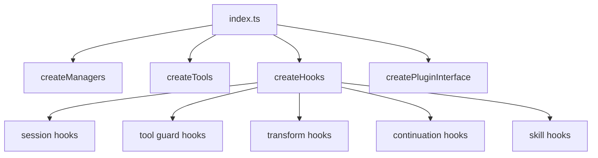
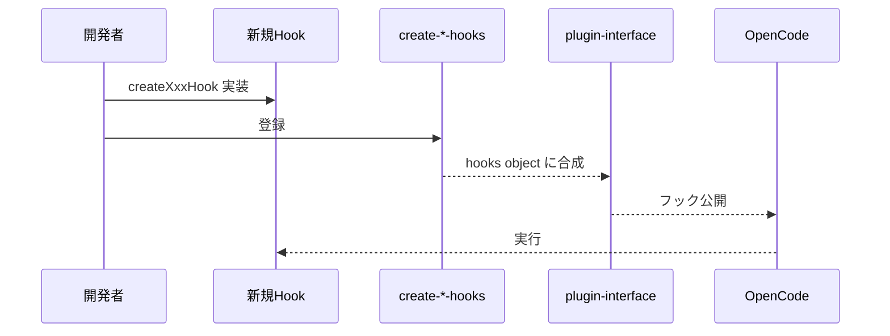

# プラグイン開発ガイド・実装ヒント

## 目次
- [1. 最小アーキテクチャパターン](#1-最小アーキテクチャパターン)
- [2. 推奨ディレクトリ構成](#2-推奨ディレクトリ構成)
- [3. 利用可能 API / インターフェース](#3-利用可能-api--インターフェース)
- [4. 実装フロー（実践）](#4-実装フロー実践)
- [5. ベストプラクティス](#5-ベストプラクティス)
- [6. 既存コードからの具体的ヒント](#6-既存コードからの具体的ヒント)
- [7. 先に読むべきファイル](#7-先に読むべきファイル)

## 1. 最小アーキテクチャパターン

このリポジトリでは、以下パターンが一貫しています。

- **Factory Pattern**: `createXxx()` で部品生成
- **Composition Root**: `index.ts` で最終合成
- **Hook Layering**: Session / Tool-Guard / Transform / Continuation / Skill
- **Safe Construction**: `safeCreateHook` による局所的失敗隔離

## 2. 推奨ディレクトリ構成

新規開発時の基本:

- Hook追加: `src/hooks/<hook-name>/` + `src/plugin/hooks/create-*.ts` に登録
- Tool追加: `src/tools/<tool-name>/` + `src/plugin/tool-registry.ts` に登録
- Provider制御拡張: `src/plugin/chat-params.ts` と `src/shared/model-*` 系を優先確認

## 3. 利用可能 API / インターフェース

主要な型境界:

- `PluginContext = Parameters<Plugin>[0]`
- `PluginInterface`（OpenCode へ返す hook object）
- `ToolsRecord = Record<string, ToolDefinition>`

実用上の観点:

- `ctx.client` 経由で `session`, `tui` などにアクセス可能
- `config` フックは `createConfigHandler` から供給
- `tool` フックは ToolDefinition の辞書

## 4. 実装フロー（実践）

1. **仕様をフック単位に分解**
   - 例: 入力前検査 → `tool.execute.before`
2. **hook factory を実装**
   - `createXxxHook()` で純粋に近い構造
3. **create-*-hooks.ts に接続**
   - `isHookEnabled` と `safeCreateHook` を通す
4. **plugin-interface.ts でイベント線を確認**
5. **session.deleted cleanup 影響を確認**

## 5. ベストプラクティス

- hook は **単機能** で作り、合成側で順序管理する。
- provider 差異は chat.params + shared 互換化で吸収し、個別分岐を最小化。
- `session.deleted` で掃除される状態を把握して、Map/Set のリークを防ぐ。
- フラグ駆動（`disabled_hooks`, `experimental`）に合わせて fail-safe に実装する。

## 6. 既存コードからの具体的ヒント

- `createChatParamsHandler`
  - 入出力を厳密に正規化し、不正フォーマット時は no-op。
- `createEventHandler`
  - hook 呼び出しは `runEventHookSafely` で保護。
  - recoverable error と model error を段階的に分離。
- `createToolRegistry`
  - 依存注入 (`toolFactories`) でテスト容易性を確保。

## 7. 先に読むべきファイル

1. `src/index.ts`
2. `src/plugin-interface.ts`
3. `src/plugin/hooks/create-session-hooks.ts`
4. `src/plugin/chat-params.ts`
5. `src/plugin/event.ts`
6. `src/plugin/tool-registry.ts`

### 要確認マーク

- ⚠ OpenCode SDK 側の型変更があった場合、`PluginContext` / hook シグネチャの追従が必要。
