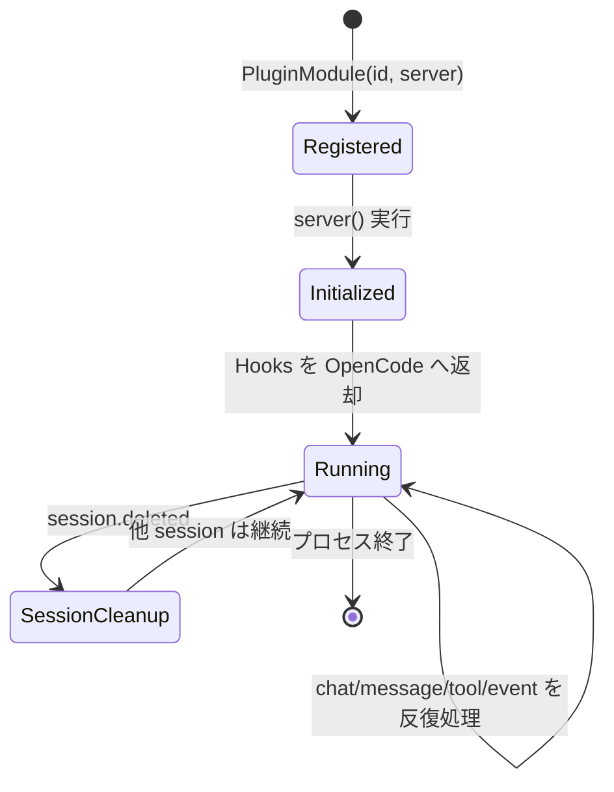
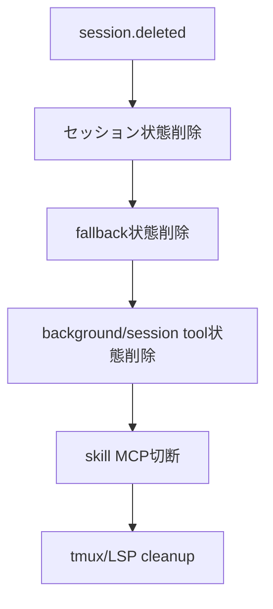

# プラグインライフサイクル詳細

## 目次
- [1. ライフサイクル全体](#1-ライフサイクル全体)
- [2. 登録フェーズ](#2-登録フェーズ)
- [3. 初期化フェーズ](#3-初期化フェーズ)
- [4. 実行フェーズ](#4-実行フェーズ)
- [5. セッション終了時の破棄・クリーンアップ](#5-セッション終了時の破棄クリーンアップ)
- [6. 実装上の重要ポイント](#6-実装上の重要ポイント)

## 1. ライフサイクル全体

## 2. 登録フェーズ

登録の本体は `pluginModule` です。

- `id: "oh-my-openagent"`
- `server: serverPlugin`

OpenCode はこの `server` を呼び、返却された hook object を実際の実行パイプラインに接続します。

## 3. 初期化フェーズ

初期化で実施される主な処理:

1. 設定ロード (`loadPluginConfig`)
2. manager 群生成 (`createManagers`)
3. tool 群生成 (`createTools`)
4. hook 群合成 (`createHooks`)
5. plugin interface 構築 (`createPluginInterface`)

`createManagers` では `config` フック実装も作成されるため、設定注入フェーズが初期化段階で確立します。

## 4. 実行フェーズ

### 4.1 chat/message 系

- `chat.message`
  - セッションの agent/model 状態を追跡
  - model fallback/runtime fallback/keyword/think mode 等を順次適用
- `chat.params`
  - セッション保存済み prompt params 適用
  - capabilities に基づく互換調整
  - anthropic-effort を後段適用

### 4.2 tool 実行系

- `tool.execute.before`
  - ルール注入・ファイル保護・入力制御
- `tool.execute.after`
  - 出力トランケート・コメント検査・後処理

### 4.3 event 系

`event` は実質的な運用オーケストレーターです。

- `session.created`: main session 記録、tmux/openclaw 連携
- `session.deleted`: 状態 Map の一括クリーンアップ
- `message.updated`/`session.status`/`session.error`: recover/fallback の起動判断

## 5. セッション終了時の破棄・クリーンアップ

`session.deleted` で実施される代表処理:

- session-agent/session-model/session-prompt 状態削除
- fallback 関連状態削除（pending chain 等）
- 背景出力消費状態の掃除
- skill MCP の session 切断
- tmux セッション連携の cleanup
- LSP 一時クライアント cleanup

## 6. 実装上の重要ポイント

- `dispatchToHooks` は各 hook の失敗を `runEventHookSafely` で局所化し、イベント全体停止を防ぎます。
- runtime fallback と model fallback は排他的に近い制御で、重複発火を抑制。
- `session.error` では recovery -> fallback の順で段階処理。

### 要確認マーク

- ⚠ プロセス終了時の `disposeHooks()` 呼び出し経路は、このリポジトリ単体では明示確認が難しい（OpenCode ホスト側責務の可能性）。
