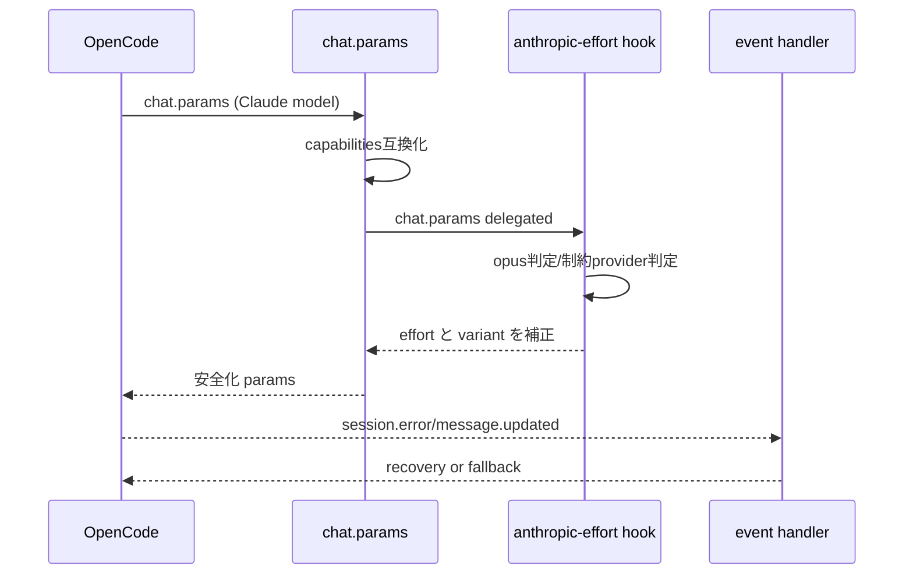

# Anthropic (Claude) インターセプト・制御詳細

## 目次
- [1. 対象範囲](#1-対象範囲)
- [2. インターセプトレイヤー](#2-インターセプトレイヤー)
- [3. インターセプトシーケンス](#3-インターセプトシーケンス)
- [4. 制御内容の詳細](#4-制御内容の詳細)
- [5. 設計思想](#5-設計思想)
- [6. 他プロバイダーとの比較](#6-他プロバイダーとの比較)

## 1. 対象範囲

Anthropic 系として以下を対象に判定します。

- `anthropic`
- `google-vertex-anthropic`
- `opencode`（Claude系を含む経路）
- `github-copilot` かつ model 名に `claude` を含むケース

## 2. インターセプトレイヤー

1. **chat.params 共通互換化層**
   - capabilities に基づく variant/reasoning/thinking の整合。
2. **Anthropic 専用フック層 (`anthropic-effort`)**
   - `variant=max` を provider/model tier に応じて clamp。
3. **event リカバリ層**
   - context window / thinking block 異常時の recovery と fallback の分離。

## 3. インターセプトシーケンス

## 4. 制御内容の詳細

- `variant=max` でも、以下条件では `high` にクランプ。
  - Opus 以外モデル
  - OAuth 制約 provider（例: anthropic OAuth, github-copilot 経由）
- 内部エージェント（title/summary/compaction）は effort 注入をスキップ。
- `output.options.effort` が既に存在する場合は上書きしない。

## 5. 設計思想

- **API 制約への防御的適合**
  - provider が受け付けない effort 値を事前に回避。
- **モデル階層の意味付け維持**
  - Opus は `max` 許容、それ以外は `high` 上限。
- **会話継続優先**
  - event 層で recoverable error を先に処理し、必要時のみ fallback。

## 6. 他プロバイダーとの比較

- Anthropic は **専用補正 hook が最も明確**。
- Codex/Gemini は共通互換化 + prompt 最適化の比率が高いが、Claude は effort 制約対応が前面に出る。

### 要確認マーク

- ⚠ Anthropic OAuth の許容パラメータは将来変更される可能性があるため、定期的な仕様追従が必要。
