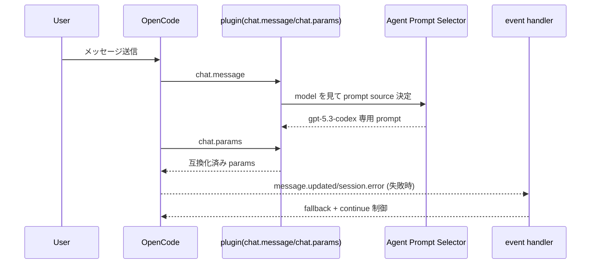

# Codex (OpenAI) インターセプト・制御詳細

## 目次
- [1. 対象範囲](#1-対象範囲)
- [2. どのレイヤーでインターセプトされるか](#2-どのレイヤーでインターセプトされるか)
- [3. インターセプトシーケンス](#3-インターセプトシーケンス)
- [4. 設計思想](#4-設計思想)
- [5. 他プロバイダーとの比較ポイント](#5-他プロバイダーとの比較ポイント)

## 1. 対象範囲

本ドキュメントでの「Codex」は、主に `openai/gpt-5.3-codex` など GPT Codex 系モデルを指します。

## 2. どのレイヤーでインターセプトされるか

1. **Agent Prompt ルーティング層**
   - Hephaestus / Sisyphus-Junior で `gpt-5.3-codex` 専用 prompt を選択。
2. **chat.params 正規化層**
   - capabilities + heuristic により variant/reasoningEffort 等を互換化。
3. **event エラー制御層**
   - `message.updated`, `session.status`, `session.error` で fallback 発火。

## 3. インターセプトシーケンス

### 実装観測ポイント

- `isGpt5_3CodexModel` により Codex 判定。
- Hephaestus は `gpt-5-3-codex.ts` を使い分け。
- runtime/model fallback 系は provider 固有というより「モデルエラー分類ベース」で動作。

## 4. 設計思想

- **モデル特化 prompt 最適化**: Codex 系には推論方針・実行方針を調整した prompt を当てる。
- **設定互換の共通化**: chat.params 段で provider 差異をならし、下流 API 失敗を削減。
- **失敗時の継続重視**: event 層で abort + continue により会話を止めにくくする。

## 5. 他プロバイダーとの比較ポイント

- Anthropic のような `output_config.effort` 専用補正は Codex では目立たない。
- Google(Gemini) と同様、prompt source の切替が主要な provider 差異吸収ポイント。

### 要確認マーク

- ⚠ OpenCode 本体が OpenAI/Codex リクエストを最終的にどうシリアライズするかは本リポジトリ外。
