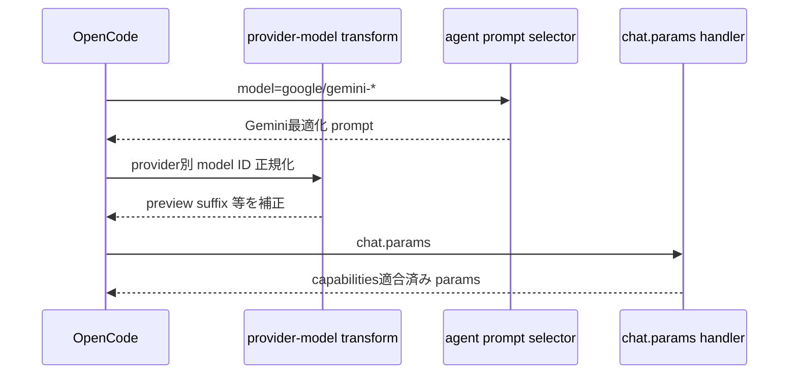

# Google (Gemini) インターセプト・制御詳細

## 目次
- [1. 対象範囲](#1-対象範囲)
- [2. インターセプトレイヤー](#2-インターセプトレイヤー)
- [3. インターセプトシーケンス](#3-インターセプトシーケンス)
- [4. 設計思想](#4-設計思想)
- [5. 他プロバイダーとの差異](#5-他プロバイダーとの差異)

## 1. 対象範囲

- `google/*`
- `google-vertex/*`
- 必要に応じて `github-copilot/gemini-*` も Gemini 判定対象

## 2. インターセプトレイヤー

1. **モデル判定層 (`isGeminiModel`)**
   - provider prefix と model 名の双方で Gemini を判定。
2. **Agent Prompt 切替層**
   - Atlas/Sisyphus-Junior などで Gemini 専用 prompt へ分岐。
3. **モデル ID 変換層**
   - provider ごとに `gemini-3.1-pro` → `gemini-3.1-pro-preview` などへ変換。
4. **chat.params 互換化層**
   - capabilities に応じて unsupported 設定を除去/ダウングレード。

## 3. インターセプトシーケンス

## 4. 設計思想

- **Gemini は prompt 最適化で吸収**
  - Atlas などの orchestrator prompt を Gemini 向けに分岐。
- **provider endpoint 差異は model ID 変換で吸収**
  - 同じ論理モデルでも provider 実装差を吸収するため、`transformModelForProvider` を利用。
- **過剰設定防止**
  - chat.params で unsupported パラメータを除去して API 不整合を減らす。

## 5. 他プロバイダーとの差異

- Anthropic ほど明示的な effort clamp は薄い。
- Codex と同様に prompt source 切替が中心だが、Gemini は preview モデル名調整の比重が高い。

### 要確認マーク

- ⚠ `google-vertex` 含む全プロバイダー組み合わせの最新互換性は、運用環境の provider 実装との差分確認が必要。
